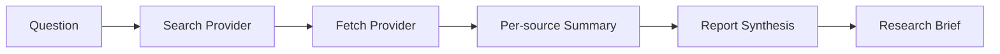

# Research Agent

Research Agent is a small CLI project for turning an open-ended question into a readable research brief from live web results.

The reason this project exists is simple: most "AI research agent" demos look good for one run, but they fall apart as soon as a page blocks scraping, a model response changes shape, or an API returns partial failure. This repo is meant to be a more honest version of that idea. The focus is not just getting text out of a model. The focus is building a research workflow that is inspectable, modular, and worth iterating on in public.

## Why Build This

I wanted a project that sits between a throwaway script and a full product:

- Small enough to understand in one sitting.
- Structured enough to grow into a better research tool over time.

The goal for this version is not "perfect autonomous research." It is a solid foundation: search for sources, fetch pages reliably, summarize what was actually retrieved, and make failures visible instead of pretending everything worked.

## What It Does

- Takes a research question from the CLI.
- Uses SerpApi to collect live search results.
- Fetches source pages with a browser-style `User-Agent`.
- Extracts readable text from each page.
- Summarizes each surviving source.
- Builds a final research brief in Markdown or JSON.
- Reports retrieval and synthesis failures explicitly.

## Design Principles

- Reliability over demo magic. Failed fetches are recorded, not hidden.
- Modular boundaries. Search, fetch, model, and report logic are separated so they can be replaced independently.
- Testability. The core pipeline can be exercised with mocks and fake providers without spending model credits.
- Honest output. If the system could not retrieve a source, the report should say so.

## Project Structure

```text
briefing/
  cli.py
  config.py
  core/
    agent.py
  domain/
    models.py
  providers/
    fetch.py
    llm.py
    search.py
tests/
main.py
```

## How It Flows



## Quickstart

1. Create and activate a virtual environment.
2. Install the dependencies.
3. Add `CLAUDE_API_KEY` and `SERPAPI_KEY` to `.env`.
4. Run a query.

```bash
python3 -m venv .venv
source .venv/bin/activate
pip install -r requirements.txt
python3 main.py "What has OpenAI launched recently?"
```

You can also run the package directly:

```bash
python3 -m briefing "Compare OpenAI and Anthropic"
```

Or install it in editable mode:

```bash
pip install -e .
research-agent "OpenAI enterprise updates"
```

Useful CLI options:

```bash
python3 main.py "Compare OpenAI and Anthropic" --format json
python3 main.py "OpenAI enterprise updates" --output report.md
python3 main.py "Recent AI safety policy changes" --max-sources 3
```

## Testing

The tests are intentionally credit-safe. They use mocks and fake providers only, so they do not call Claude or run the live agent against external services.

```bash
python3 -m unittest discover -s tests -v
```

## What Changed In Phase 1

This version fixes the main problems from the original prototype:

- Anthropic text blocks are parsed correctly instead of printing `TextBlock(...)`.
- Requests use a browser-style `User-Agent`, which reduces basic `403` failures.
- Failed fetches are tracked as failures instead of being summarized as page content.
- The code is organized into `core`, `domain`, and `providers` modules.
- The CLI can emit either Markdown or JSON output.
- The pipeline is testable without paying for model calls.

## Current Limitations

- Search currently depends on SerpApi only.
- Content extraction is still lightweight and could be improved with a stronger readability layer.
- Final synthesis quality still depends on the model and the quality of the retrieved sources.
- There is no caching yet, so repeated runs will hit the same services again.

## Roadmap

- Add caching for fetched pages and model outputs.
- Improve extraction for noisy articles and docs pages.
- Add richer citations in the final brief.
- Save reports to an `examples/` or `reports/` folder for showcase demos.
- Add CI so the repo is easier to trust at a glance.
