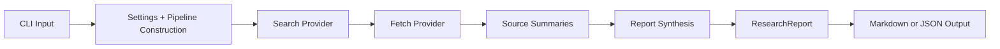

# Research Agent Documentation

This document explains how the current agent is designed, how the code is organized, and why certain architectural choices were made in phase 1.

It is written for two audiences at once:

- Someone reading the repo on GitHub who wants to understand the system.
- You, as the builder, so the codebase stays understandable as it grows.

## What This Project Actually Is

At the moment, this is not a fully autonomous planning agent with long-running memory, tool loops, retries, or task decomposition.

It is a structured research pipeline.

That distinction matters.

The current system takes a user question, collects web results, fetches page content, summarizes each surviving source, and then synthesizes a final brief. It behaves more like a deterministic workflow with model-assisted steps than like an open-ended autonomous agent.

That is intentional.

For a showcase project, a simple pipeline with clear stages is easier to trust, easier to test, and easier to explain than a vague "agent" that hides its behavior behind prompts.

## Design Goals

The phase-1 architecture is built around a few design goals:

### 1. Reliability over demo polish

The original prototype could appear to work while actually summarizing errors. That is the wrong failure mode for a research tool.

The current version prefers explicit failure reporting over pretending everything succeeded.

### 2. Modularity over convenience

Search, fetching, summarization, and report synthesis are separate concerns. Keeping them separate makes it easier to swap providers later.

### 3. Testability over cleverness

The pipeline is designed so the important parts can be tested with mocks and fake providers. This matters because live model calls are expensive and unstable.

### 4. Honest output

If a source fails to fetch, the final report should say that. If synthesis fails, the system should degrade into a simpler fallback instead of returning nonsense.

### 5. Small but extensible structure

The codebase is intentionally small, but it already has enough boundaries to support caching, better extraction, alternate search backends, and richer report generation later.

## High-Level Architecture



The main execution path is:

1. Parse CLI arguments.
2. Load environment-backed settings.
3. Build the default pipeline.
4. Search for candidate sources.
5. Fetch and extract readable content from each result.
6. Summarize each source individually.
7. Synthesize an overall report.
8. Serialize the report as Markdown or JSON.

## Code Layout

```text
briefing/
  __init__.py
  __main__.py
  api/
    app.py
    schemas.py
  cli.py
  config.py
  core/
    agent.py
  domain/
    models.py
  memory/
    store.py
  providers/
    fetch.py
    llm.py
    search.py
frontend/
  src/
tests/
main.py
```

### Why This Structure

The folders reflect responsibility, not technology:

- `briefing/core`
  Contains orchestration logic. This is where the pipeline coordinates the stages.
- `briefing/domain`
  Contains the data model. These objects describe what the system works with.
- `briefing/providers`
  Contains external-facing adapters: search, HTTP fetching, and LLM interaction.

This separation keeps the core logic from being tightly coupled to any single vendor SDK or transport detail.

## Interfaces

The project currently has two user-facing interfaces:

- a CLI in [briefing/cli.py](/Users/elvishasanaje/research_agent/briefing/cli.py)
- an HTTP API in [briefing/api/app.py](/Users/elvishasanaje/research_agent/briefing/api/app.py)
- a separate React frontend in [frontend/](/Users/elvishasanaje/research_agent/frontend)

Both interfaces call the same pipeline. This is deliberate. The transport layer changes, but the core research behavior does not.

## How The Code Works

### CLI layer

File: [briefing/cli.py](/Users/elvishasanaje/research_agent/briefing/cli.py)

The CLI is the top-level interface. It does four things:

- Parses arguments like `--format`, `--max-sources`, and `--output`.
- Loads settings from `.env`.
- Builds the default pipeline.
- Prints or writes the final report.

It does not contain the research logic itself. That is a deliberate boundary. The CLI should stay thin.

### API layer

Files:

- [briefing/api/app.py](/Users/elvishasanaje/research_agent/briefing/api/app.py)
- [briefing/api/schemas.py](/Users/elvishasanaje/research_agent/briefing/api/schemas.py)

The FastAPI app is a second interface over the same pipeline.

It currently exposes:

- `GET /`
- `GET /api/health`
- `POST /api/research`
- `GET /api/conversations`
- `POST /api/conversations/{id}/messages`

The API layer is intentionally thin. Its responsibilities are:

- validate request bodies
- construct or obtain a pipeline instance
- map pipeline errors to HTTP responses
- serialize `ResearchReport` into JSON
- manage conversation state through the memory store
- serve the built frontend assets

It should not contain fetching, search, or model logic.

### Why add FastAPI now

There are a few reasons this is a good architectural step:

- It makes the project easier to demo.
- It creates a path toward a frontend or hosted service.
- It forces the core pipeline to remain interface-agnostic.

The key constraint is that the API should wrap the pipeline, not replace it.

### Frontend architecture

The chat UI now lives in a separate React app under `frontend/`.

That frontend is intentionally lightweight:

- Vite for build/dev tooling
- React for rendering and state
- `fetch()` calls to the FastAPI `/api` routes
- conversation history loaded from the backend instead of `localStorage`

Why keep it this simple?

- Easier to ship quickly.
- Easier to inspect in a small repo.
- Enough structure to grow without bringing in a larger frontend stack.

Tradeoff:

- Conversation memory is local SQLite persistence, not a shared multi-instance store.
- There is no streaming response rendering yet.
- The "chat" metaphor is a UI layer over a one-shot research pipeline, not a multi-turn reasoning backend.

## Deployment Architecture

The repo now supports a container-first deployment model.

Files:

- [Dockerfile](/Users/elvishasanaje/research_agent/Dockerfile)
- [compose.yml](/Users/elvishasanaje/research_agent/compose.yml)
- [ci.yml](/Users/elvishasanaje/research_agent/.github/workflows/ci.yml)
- [docker-publish.yml](/Users/elvishasanaje/research_agent/.github/workflows/docker-publish.yml)

### Docker shape

The Docker image uses a multi-stage build:

1. a Node stage to build the React frontend
2. a Python runtime stage to run FastAPI and serve the built frontend

Why this shape:

- One deployable artifact.
- No separate frontend container required for a simple deployment.
- Smaller runtime image than shipping Node in production.

Tradeoff:

- Frontend changes require rebuilding the application image.
- This is optimized for simplicity, not for independently scaling frontend and backend tiers.

### Compose shape

`compose.yml` runs a single app container and mounts `./data` into `/app/data`.

Why:

- SQLite needs a writable persistent volume.
- This is the smallest useful local deployment setup.

Tradeoff:

- The deployment is single-node by design.
- SQLite is a reasonable local persistence layer, but not the right choice for horizontally scaled production.

### CI/CD shape

The CI workflow does three things:

- run Python tests
- build the React frontend
- build the Docker image

The Docker publish workflow pushes images to GHCR.

Why keep CI and image publishing separate:

- CI should validate every PR and branch change.
- Registry publishing should happen only on selected branches, tags, or manual runs.

## Memory Architecture

Files:

- [briefing/memory/store.py](/Users/elvishasanaje/research_agent/briefing/memory/store.py)
- [briefing/domain/models.py](/Users/elvishasanaje/research_agent/briefing/domain/models.py)

The project now has explicit conversation state on the backend.

The memory store is currently:

- backed by SQLite
- local to the running app instance and its database file
- sufficient for a single-node deployment

Each conversation keeps:

- metadata like title and timestamps
- ordered message history
- assistant reports attached to assistant messages

This is a deliberate first step.

Why SQLite first?

- It gives persistence without introducing infrastructure overhead.
- It is part of the Python standard library.
- It is enough for a local app and a showcase deployment.

Tradeoff:

- It is not a full multi-user production datastore.
- Concurrent write patterns are still limited compared with a dedicated database server.

### Configuration

File: [briefing/config.py](/Users/elvishasanaje/research_agent/briefing/config.py)

`Settings` is a dataclass that centralizes environment-driven configuration:

- `CLAUDE_API_KEY`
- `SERPAPI_KEY`
- model name
- max search results
- request timeout
- max fetched document length
- conversation database path

Why use a settings object instead of reading env vars all over the code?

- It makes configuration explicit.
- It gives the rest of the system a stable input contract.
- It makes testing and future overrides easier.

### Domain models

File: [briefing/domain/models.py](/Users/elvishasanaje/research_agent/briefing/domain/models.py)

The domain layer defines the core data the pipeline moves around:

- `SearchResult`
- `Document`
- `SourceSummary`
- `SourceFailure`
- `ResearchReport`

This is important because it prevents the codebase from passing around unstructured dictionaries everywhere.

The benefit is clarity:

- Search returns `SearchResult`
- Fetching returns `Document`
- Summarization returns `SourceSummary`
- Errors become `SourceFailure`
- The final output is `ResearchReport`

That gives the pipeline a predictable shape.

### Core pipeline

File: [briefing/core/agent.py](/Users/elvishasanaje/research_agent/briefing/core/agent.py)

`ResearchPipeline` is the orchestration layer.

Its job is not to know how SerpApi works, how `requests` works, or how Anthropic works. Its job is to coordinate stages.

The pipeline constructor accepts:

- a `SearchProvider`
- a `DocumentFetcher`
- a `ResearchWriter`
- a `max_search_results` limit

This is dependency injection in a simple form. It matters because it keeps orchestration logic independent from implementation details.

The `run()` flow is:

1. Validate the query.
2. Get search results.
3. For each result:
   - fetch the page
   - summarize the page
   - collect failures without crashing the entire run
4. If every source fails, return a failure-oriented report.
5. Otherwise, synthesize a final executive summary and key findings.
6. If synthesis fails, fall back to derived findings from the source summaries.

### Search provider

File: [briefing/providers/search.py](/Users/elvishasanaje/research_agent/briefing/providers/search.py)

`SerpApiSearchProvider` is the current concrete search adapter.

The provider:

- validates that an API key exists
- calls SerpApi
- normalizes the response into `SearchResult` objects
- raises `SearchError` for provider-level failures

The important design choice here is that the rest of the system does not depend on raw SerpApi payloads.

That means this can later be replaced with:

- another search API
- a local document store
- a hybrid search strategy

without rewriting the pipeline.

### Fetch provider

File: [briefing/providers/fetch.py](/Users/elvishasanaje/research_agent/briefing/providers/fetch.py)

`RequestsDocumentFetcher` is responsible for turning a `SearchResult` into a `Document`.

Key responsibilities:

- send HTTP requests with browser-style headers
- raise clean `FetchError` exceptions for network or HTTP failures
- extract readable text from HTML
- truncate content to a configured maximum length

The current extraction strategy is intentionally simple:

- remove noisy tags like `script`, `style`, `nav`, and `aside`
- prefer `main`, then `article`, then `body`
- normalize whitespace

This is not perfect, but it is better than summarizing the entire raw HTML or error strings.

### LLM provider

File: [briefing/providers/llm.py](/Users/elvishasanaje/research_agent/briefing/providers/llm.py)

`AnthropicResearchWriter` handles the model-facing steps.

It currently performs two separate model operations:

- summarize each source
- synthesize the final report

The helper `extract_text_from_content_blocks()` exists because SDK responses are structured as blocks, not plain strings. That helper makes the parsing logic explicit and reusable.

The synthesis step requests strict JSON so the result can be parsed into:

- `executive_summary`
- `key_findings`

If that parsing fails, the pipeline falls back to simpler derived findings instead of crashing outright.

## Why Separate Per-Source Summarization From Final Synthesis

This is one of the main architectural choices in the project.

Instead of dumping all fetched source text into one giant model prompt, the system does:

1. source-level summarization
2. final synthesis

### Benefits

- Each source gets normalized into a smaller, more comparable unit.
- The final synthesis prompt stays shorter and more stable.
- Partial failures are easier to isolate.
- You can inspect intermediate outputs.

### Costs

- More model calls.
- More latency.
- More cumulative prompt engineering surface area.

For a small showcase tool, this tradeoff is still worth it because transparency and control matter more than raw efficiency.

## Why Use Protocols

The provider interfaces use `Protocol` types instead of concrete base classes.

That choice keeps things lightweight.

Benefits:

- No inheritance ceremony.
- Easy to mock in tests.
- Simple replacement with alternate implementations.

Tradeoff:

- There is less runtime enforcement than with a deeper class hierarchy.

For this repo, that is acceptable because the interfaces are small and easy to reason about.

## Failure Handling Strategy

One of the biggest design decisions is that most failures are collected, not immediately fatal.

Examples:

- One bad URL should not kill the whole run.
- One malformed model response should not erase all successful source work.

So the system accumulates `SourceFailure` items and includes them in the `ResearchReport`.

### Why This Is Better

- The user sees what succeeded and what failed.
- The pipeline produces partial value when possible.
- The failure mode is visible and debuggable.

### Tradeoff

The report can contain mixed-quality results if several sources fail. That is still preferable to a false success signal or a complete crash for a non-critical error.

## Output Model

The final output is represented by `ResearchReport`.

This object is more important than it might look.

It gives the system a stable final artifact with two serialization paths:

- `to_markdown()`
- `to_dict()`

That means the internal result format is separate from how it gets displayed.

This is useful for future steps like:

- saving reports to disk
- building a web UI
- exposing an API endpoint
- adding export formats later

## Architectural Tradeoffs

### 1. Pipeline instead of agent loop

Chosen:

- A linear, stage-based pipeline.

Why:

- Easier to explain.
- Easier to test.
- Easier to debug.

Tradeoff:

- Less flexible than a planner/executor loop.
- No dynamic tool selection or retry strategy yet.

### 2. Simplicity in HTML extraction

Chosen:

- Basic BeautifulSoup extraction.

Why:

- Low complexity.
- Easy to understand.
- Good enough for phase 1.

Tradeoff:

- Not as robust as readability libraries or headless-browser extraction.
- More likely to include noise on complex sites.

### 3. SerpApi as the only search backend

Chosen:

- Single search provider for now.

Why:

- Faster to get a working end-to-end pipeline.

Tradeoff:

- Tight operational dependency on one service.
- No fallback provider yet.

### 4. Two-stage model workflow

Chosen:

- Summaries first, synthesis second.

Why:

- Better control.
- Better inspectability.

Tradeoff:

- More calls.
- Higher cost and latency.

### 5. Runtime configuration through `.env`

Chosen:

- Environment-based configuration.

Why:

- Standard for local development.
- Keeps secrets out of code.

Tradeoff:

- Less ergonomic than a richer config system once the project grows.

### 6. Thin HTTP wrapper instead of HTTP-first architecture

Chosen:

- FastAPI as a transport layer around the pipeline.

Why:

- Keeps the core reusable from both CLI and API.
- Avoids duplicating business logic.
- Makes the app easier to test with fake pipelines.

Tradeoff:

- The API is currently synchronous.
- There is no job queue, streaming, or background execution yet.

### 7. SQLite conversation memory instead of a larger database system

Chosen:

- A simple server-side SQLite store.

Why:

- It enables follow-up questions and persistence now.
- It keeps memory logic out of the frontend.
- It is simple enough to change later.

Tradeoff:

- This is still local persistence, not distributed state.
- No shared state across multiple server instances.

## Extension Points

The code is already shaped so future changes fit naturally.

### Alternate search providers

You can add another implementation of the `SearchProvider` protocol and swap it into `ResearchPipeline`.

### Better fetch strategies

You can replace `RequestsDocumentFetcher` with:

- a readability-based extractor
- a headless browser fetcher
- a cached fetch layer

### Alternate model providers

You can add another `ResearchWriter` implementation for another model vendor or for local models.

### Caching

Caching can sit at several layers:

- search result caching
- fetched document caching
- source summary caching
- final report caching

### Report quality improvements

Future report upgrades could include:

- inline citations
- confidence notes
- contradiction detection across sources
- better synthesis schemas

## Testing Strategy

The tests in `tests/` are intentionally built around mocks and fake implementations.

Why:

- No model credits needed.
- No flaky network dependency.
- Faster feedback during refactors.

The current tests cover:

- fetch behavior and header usage
- Anthropic content block parsing
- pipeline behavior with partial failures

This is not full coverage, but it protects the most failure-prone logic introduced in phase 1.

## Known Weak Spots

Even after the refactor, the system still has obvious limitations:

- no caching
- no retries
- no concurrency
- no advanced content cleaning
- no citation grounding in the final report
- no ranking or deduplication beyond the raw search order

That is acceptable for phase 1, but these are the natural next steps.

## How To Reason About Future Changes

If you add a feature, the first question should be:

"Which layer does this belong to?"

Use this rule of thumb:

- If it is about control flow, it probably belongs in `core`.
- If it is about data shape, it belongs in `domain`.
- If it talks to an external service or SDK, it belongs in `providers`.
- If it only changes how users invoke the system, it belongs in `cli.py`.

That rule will keep the project from turning back into a single-file script.

## Suggested Next Architectural Moves

If you continue with phase 2, these would be the highest-value improvements:

1. Add caching so repeated runs are cheaper and faster.
2. Add a richer extraction layer for article pages and docs pages.
3. Add report citations tied back to source summaries.
4. Add retries and timeout handling around brittle network calls.
5. Add saved example reports for demo and regression checking.

## Final Summary

The current architecture is intentionally conservative.

It is not trying to be the most autonomous agent possible. It is trying to be a solid foundation for a research assistant that behaves predictably, exposes its failures, and can be evolved without collapsing into untestable prompt glue.

That is the right tradeoff for where the project is right now.
